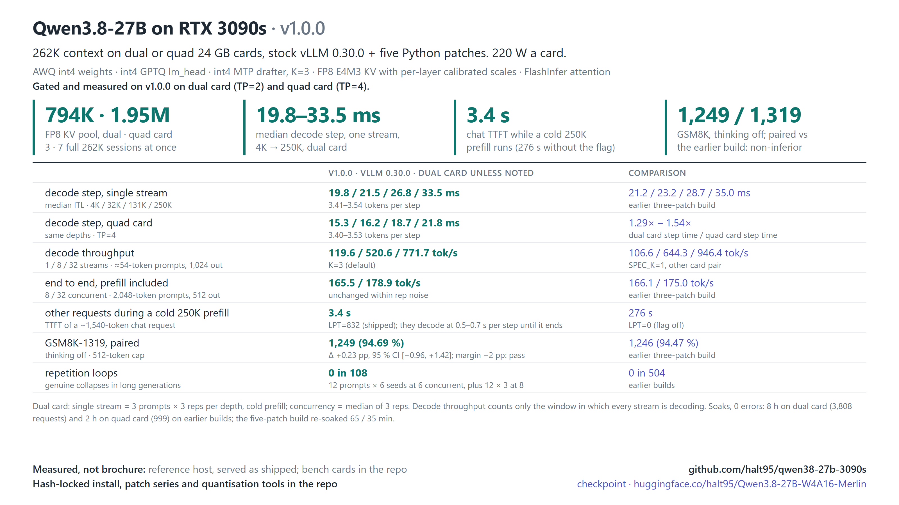

# Qwen3.8-27B at 262K context on dual or quad RTX 3090s

Qwen3.8-27B (a 27B hybrid of Gated DeltaNet linear attention and full attention, with a vision tower and a one-layer
MTP head) served with vLLM at its **full 262,144-token context** on consumer Ampere cards, MTP K=3, int4 weights,
`lm_head` and drafter:

- **Dual card (2× RTX 3090):** a **794,351-token** FP8 KV pool, three full 262K sessions at once.
- **Quad card (4× RTX 3090):** a **1,949,844-token** FP8 KV pool, seven full 262K sessions at once, and 22–35 % lower
  decode step time than dual card.

It runs on **stock vLLM 0.30.0 from PyPI plus five Python patches**: nothing is compiled at install time, and every
dependency is hash-locked. **v1.0.0** is the first public release. Validated on sm_86 (Ampere) only.

[](#hardware)
[](#the-kv-budget)
[](#the-kv-budget)
[](#stack)
[](#stack)
[](https://huggingface.co/halt95/Qwen3.8-27B-W4A16-Merlin)

## v1.0.0 at a glance



- **794,351-token FP8 E4M3 KV pool: 3 × 262K sessions with dual cards (TP=2).** Calibrated per-layer scales, pinned
  in bytes.
- **1,949,844-token FP8 E4M3 KV pool: 7 × 262K sessions with quad cards (TP=4).** 15.3 ms per decode step at 4K and
  21.8 ms at 250K; 1,120.9 tok/s decode throughput at 32 streams; a chat request starts in 2.0 s while a 250K prompt
  prefills.
- **Our own host-resident embedding table** (patch 3) keeps the token embeddings in pinned
  host RAM and frees 1.184 GiB per card for KV ([how it works](#host-resident-embeddings-our-design)).
- **Stock vLLM 0.30.0 plus five patches**, all on by default and each with an off switch except the first: MTP verify
  batches captured by FULL cudagraphs on Ampere (a port of part of vLLM PR #47979), a FlashInfer decode-plan cache,
  the host-resident embedding table, a split-K GEMM for a small GDN projection, and one device sync removed from the
  MTP draft loop ([What is in v1.0.0](#what-is-in-v100)).
- **Single stream, dual card: 19.8 ms per decode step at 4K, 33.5 ms at 250K**, 3.4–3.5 tokens per step; 4–7 % lower step
  time than the unpublished three-patch build it replaces. **Quad card: 15.3 ms at 4K, 21.8 ms at 250K.**
- **Chat stays responsive during a long cold prefill.** `--long-prefill-token-threshold 832` is on by default: a chat
  request that arrives while a 250K prompt is prefilling starts in 3.4 s instead of 276 s.
- **Quality held.** Paired GSM8K-1319 against the earlier build: 94.69 % vs 94.47 %, inside a −2 pp non-inferiority
  margin fixed before the run; 0 repetition collapses in 108 long generations.
- **`SPEC_K=1`** for many concurrent decode-heavy streams: 946.4 tok/s at 32 concurrent against K=3's 771.7; K=3
  stays the default because it is faster for 1–2 streams on dual card (119.6 vs 106.6 tok/s for one; level on quad card).

Measured on the reference host ([Benchmarks](#benchmarks)); the bench cards are in [`benchmarks/`](benchmarks/). To run it: [Quick start](#quick-start).

## Quick start

See [Requirements](#requirements) first (Linux x86_64, Python 3.13, an NVIDIA driver for CUDA 13.0, a CUDA toolkit
with `nvcc`, about 25 GB of disk, and about 2.4 GiB of extra host RAM for the embedding table).

```bash
git clone --branch v1.0.0 https://github.com/halt95/qwen38-27b-3090s && cd qwen38-27b-3090s
sha256sum -c release/SHA256SUMS                          # the repository files
# 1. the environment: hash-locked vLLM 0.30.0 + the patch series (about 8 GB)
release/install-env.sh .venv
# 2. the checkpoint (about 17 GB): int4 weights, int4 lm_head + MTP drafter, calibrated FP8 KV scales
HF_HUB_DISABLE_TELEMETRY=1 .venv/bin/hf download halt95/Qwen3.8-27B-W4A16-Merlin --local-dir ./ckpt
(cd ckpt && sha256sum -c ../release/checkpoint.sha256)   # the 11 checkpoint files
# 3. serve on two cards (serve/serve-tp4.sh for four); needs working GPU peer-to-peer, see Requirements
MODEL=$PWD/ckpt serve/serve.sh
```

The server listens on `127.0.0.1:8100` and serves the model as `qwen38-27b`:

```bash
curl http://127.0.0.1:8100/v1/chat/completions \
  -H 'Content-Type: application/json' \
  -d '{"model":"qwen38-27b","messages":[{"role":"user","content":"Explain the difference between a stack and a queue."}]}'
```

How to tell the server is healthy: [Check it's working](#check-its-working). Read
[Known behaviours](#known-behaviours-of-qwen38-27b-in-vllm-030) before putting it in front of clients.

## Build and serve

| path | what |
|---|---|
| `release/install-env.sh` | creates the venv, installs pip and every dependency from hash-locked files (`pip install --require-hashes`), applies `patches/vllm-0.30.0/` with every exit code checked, asserts each patch's marker and runs `pip check`; refuses to overwrite an existing venv |
| `release/requirements-pinned.txt`, `requirements-pip.txt`, `hash_lock.py` | the hash-locked environment (`vllm==0.30.0`, `torch==2.13.0` from PyPI, which is the CUDA 13.0 build, `flashinfer-python==0.6.18.post1`) and the script that rebuilds the lock from PyPI metadata |
| `release/checkpoint.sha256` | checksums of the 11 checkpoint files |
| `release/SHA256SUMS`, `PACKAGE-MANIFEST.md`, `make_manifest.py` | checksums, mode and size of every other file, and the script that writes them from the staged tree |
| `patches/vllm-0.30.0/` | the five patches against the PyPI wheel, with per-patch defaults, off switches, proof lines and limits in its [README](patches/vllm-0.30.0/README.md) |
| `serve/serve.sh`, `serve/serve-tp4.sh` | the served entries (dual card, quad card), with every host-specific piece lifted into a variable; `serve/templates/` holds the vendored chat template |
| `quant/` | the tools that made the checkpoint's additions: KV-scale calibration (`kvcal.py`, `kvcal_write.py`), head and drafter calibration (`mtpcal.py`), GPTQ int4 of `lm_head` and the drafter (`quantize_head_mtp.py`), an artefact identity check, and the calibrated KV scales as written (`kv_scales-philbert-e4m3.json`) |
| `benchmarks/<date>/BENCH-CARD.md` | the bench cards: `2026-09-26` is v1.0.0 on dual and quad card, `2026-09-25` the earlier three-patch build it is compared with |
| `docs/` | the release graphics (`docs/images/`) and the repetition-loop check (`loop-check.md`) |

The patches are pure Python. FlashInfer JIT-compiles its kernels with `nvcc` on the first boot of a new install, which
takes several minutes; later boots reuse the cache.

**Serve-script variables:** `MODEL` is required; the rest are optional: `PORT` (8100), `HOST` (127.0.0.1), `SERVED`
(`qwen38-27b`), `VENV` (`<repo>/.venv`), `GPUS` (`0,1`; `0,1,2,3` for quad card, PCI bus order), `KV_BYTES` (the per-card
pool pin; `auto` drops it), `LPT` (832; `0` removes the flag), `SPEC_K` (3 or 1), `CHAT_TEMPLATE` (empty = the
checkpoint's own), `THINKING` (default chat-template kwargs: thinking on, medium effort), `CUDA_HOME`
(`/usr/local/cuda`, for FlashInfer's JIT). The patch switches are environment variables of their own
([What is in v1.0.0](#what-is-in-v100)).

`HOST=0.0.0.0` exposes an endpoint without an API key on every interface: if the host is reachable from other machines,
set `VLLM_API_KEY` in the environment (clients then send `Authorization: Bearer <key>`), or keep the default
`127.0.0.1` behind a proxy.

**Telemetry.** Both serve scripts disable vLLM's usage statistics by default (`VLLM_NO_USAGE_STATS=1`,
`DO_NOT_TRACK=1`); set both to `0` to opt in. The download step sets `HF_HUB_DISABLE_TELEMETRY=1` for the same reason.

### Which profile

| Profile | Cards | Context | Status |
|---|---:|---:|---|
| `serve/serve.sh` | dual card (2, TP=2) | 262K | Headline profile; v1.0.0 gated and measured on dual card |
| `serve/serve-tp4.sh` | quad card (4, TP=4) | 262K | Measured on v1.0.0, which also passed GSM8K-1319 and the smokes at the shipped pin; soak on earlier builds (see [Scope of the quad card numbers](#scope-of-the-quad-card-numbers)); needs P2P |
| Single card | 1 | — | Not supported (soon TM) |

### Requirements

| | Required | Reference host |
|---|---|---|
| GPUs | 2× (dual card) or 4× (quad card) 24 GB sm_86 cards, with no other process on them | RTX 3090 |
| OS | Linux x86_64 with glibc ≥ 2.31 (the `llguidance` wheel is manylinux_2_31) | Debian 13, glibc 2.41 |
| NVIDIA driver | one that supports CUDA 13.0 (the PyPI torch 2.13.0 wheel) | 610.43.02, P2P-enabled |
| CUDA toolkit | `nvcc` at `/usr/local/cuda` or `$CUDA_HOME`, for FlashInfer's JIT | 13.3 |
| Python | 3.13, with `venv` | 3.13 |
| Tools | git, `sha256sum` | |
| Disk | about 17 GB (15.9 GiB) for the checkpoint + about 8 GB for the venv | |
| System RAM | **about 2.4 GiB more than a standard vLLM serve**: the token-embedding table lives in pinned host RAM ([patch 3](#host-resident-embeddings-our-design)), 1.18 GiB per GPU on dual card or 0.59 on quad card | 192 GB host (96 GB to the serving container) |
| Interconnect | GPU peer-to-peer (P2P) as shipped: both serve scripts skip vLLM's P2P check and set `NCCL_P2P_LEVEL=SYS`. Without P2P remove those two settings (unmeasured). PCIe Gen4 x16 and P2P were used for every measurement | P2P-enabled driver |

Not yet run outside the reference host: no other GPU, distribution, driver or non-P2P host.

### Check it's working

The serve log shows, in order (dual card; the quad card pool line reads 1,949,844):

```text
HOST-RESIDENT EMBED TABLE: freed 1.184 GiB of VRAM on this rank ...    # patch 3, once per rank (0.592 at TP=4)
GPU KV cache size: 794,351 tokens, Maximum concurrency for 262,144 tokens per request: 3.03x
DRAFT SEQ_LENS NOSYNC ACTIVE: draft step 2 ...                          # patch 5, once per rank
flashinfer plan cache: call N, H hits / M misses ...                    # patch 2, repeated
GDN in_proj_ba SPLIT-K ACTIVE: M=5 N=48 K=5120 S=16 ...                 # patch 4, once per rank (N=24 at TP=4)
Application startup complete.
```

The pool is pinned in bytes, so any other KV number means the serve command, the checkpoint or the environment is not
the shipped one (with `SPEC_K=1` the same pins read 810,191 and 1,987,859). On the reference host a boot on a fresh compile cache took about 4.3 minutes (dual and quad card) and a boot
on a warm cache about 1.3 minutes (dual card), with no other boot running on the host; two fresh boots compiling at once
took 7–9 minutes each. Then send a real generation:

```bash
curl -s http://127.0.0.1:8100/v1/chat/completions -H 'Content-Type: application/json' \
  -d '{"model":"qwen38-27b","messages":[{"role":"user","content":"ok"}],"max_tokens":16,"chat_template_kwargs":{"enable_thinking":false}}'
```

Do not use `/v1/models` as a health check: it keeps answering 200 after the engine has died. A one-token generation is
the check.

### Troubleshooting

- CUDA out-of-memory, or a refusal because free memory is below the requested utilisation, at boot on one card: a
  display server or another process holds memory on it (`nvidia-smi`). The KV pool is pinned in bytes with
  `--gpu-memory-utilization 0.96`, so each card must be otherwise empty (the quad card pin leaves about 1 GB free
  per card); free the card, or pick others with `GPUS=`.
  As a last resort `KV_BYTES=auto` lets vLLM size a smaller pool; that configuration is not qualified.
- The model load is killed by the kernel's OOM killer with nothing useful in the vLLM log: host RAM is below the
  [requirement](#requirements).
- FlashInfer fails to compile on the first boot or the first request: `nvcc` was not found. Install a CUDA toolkit and
  point `CUDA_HOME` at it.
- `release/install-env.sh` stops at the start: the target venv already exists; it never overwrites one. Pass a new path.
- A crash at startup after changing `--limit-mm-per-prompt`: vLLM 0.30's compile cache does not key on it; point
  `VLLM_CACHE_ROOT` at a new directory ([Known behaviours](#known-behaviours-of-qwen38-27b-in-vllm-030)).
- `SPEC_K must be 1 or 3`: the serve scripts accept only the two measured values.
- A GPU other than sm_86: set `VLLM_FLASHINFER_PLAN_CACHE=0` (patch 2's plan-cache key is sound only for the
  FlashInfer FA2 planner). Everything else is unmeasured there.
- A driver without peer-to-peer (the stock driver on consumer cards): remove `VLLM_SKIP_P2P_CHECK=1` and
  `NCCL_P2P_LEVEL=SYS` from the serve script. That configuration is unmeasured.
- `/v1/models` answers but completions fail or never return: the engine has died; read the log from the first error.
- Empty `content` with `finish_reason: "length"`: thinking is on and `max_tokens` ended inside the reasoning; raise
  `max_tokens` or send `"chat_template_kwargs":{"enable_thinking":false}`.

### Running notes

Both serve scripts also export `PYTORCH_CUDA_ALLOC_CONF=expandable_segments:True` and
`VLLM_MEMORY_PROFILER_ESTIMATE_CUDAGRAPHS=0` (the pool is pinned, so the profiler's graph reserve is not needed); the
measurements include both.

Lines every boot logs that are not failures: `Unknown vLLM environment variable detected: VLLM_ATTENTION_BACKEND` (the
serve scripts also export the old variable; the `--attention-backend FLASHINFER` flag is what selects the backend),
`SymmMemCommunicator: Device capability 8.6 not supported`, `FlashInfer All Reduce is disabled because it is not
supported for world_size=2`, `max_num_scheduled_tokens is set to 4096 based on the speculative decoding settings`,
`Speculative decoding (method=mtp) is enabled but no KV cache group could be identified as the draft model's`,
`Enabling num_speculative_tokens > 1 will run multiple times of forward on same MTP layer`, `Qwen3.5 model specifies
mamba_ssm_dtype='float32' in its config, but --mamba-ssm-cache-dtype='float16' was passed` (fp16 is the measured
choice) and `Add 3 padding layers, may waste at most 6.25% KV cache memory`. The pool figures above already include
the padding.

Sampling is pinned server-side (temperature 1.0, top-p 0.95, top-k 20, no presence or repetition penalty); a request can
still override it.

## What is in v1.0.0

Stock vLLM 0.30.0 plus five patches, all on by default, and three serve-script settings:

1. **Uniform multi-token decode on Ampere: a port of part of vLLM PR #47979** (an open draft
   upstream). MTP verify batches run as decode, so FULL cudagraphs capture them on sm_86. No
   switch; remove the patch to disable.
2. **Single-entry FlashInfer decode-plan cache.** Reuses the decode plan when the schedule
   can't have changed. **Validated on sm_86 with the FlashInfer FA2 backend only; on any other
   GPU set `VLLM_FLASHINFER_PLAN_CACHE=0`** (the patch has no runtime backend guard).
3. **Host-resident token embedding table (our design).** Frees 1.184 GiB per card on dual card (0.592 GiB on
   quad card) for KV cache. Measured on PCIe Gen4 x16. Disable with `VLLM_HOST_EMBED_TABLE=0`
   ([how it works](#host-resident-embeddings-our-design)).
4. **Split-K GEMM for the GDN `in_proj_ba` projection at ≤ 16 tokens.** On sm_86 cuBLAS picks a
   4-CTA kernel for this small matrix at every MTP verify step (48 layers per step); a Triton
   split-K takes about a quarter of the time. Disable with `VLLM_GDN_BA_SPLITK=0`.
5. **No device sync for the second MTP draft step's sequence lengths.** They are always the
   first draft step's lengths + 1, so the patch derives them on the CPU. A verify mode
   (`VLLM_DRAFT_SEQ_LENS_VERIFY=1`) syncs anyway and compares. Disable with
   `VLLM_DRAFT_SEQ_LENS_NOSYNC=0`.
6. **`--long-prefill-token-threshold 832`** (`LPT=832`, default). Lets other requests start
   while a long cold prefill runs; see [Long prompts](#long-prompts-and-other-requests).
   `LPT=0` removes the flag.
7. **`SPEC_K`** = MTP draft tokens per step, `3` (default) or `1`; see [SPEC_K=1](#spec_k1).
8. **Chat template:** froggeric's Qwen-Fixed-Chat-Templates v22.5, vendored unmodified under
   `serve/templates/` and credited in [NOTICE](NOTICE). `CHAT_TEMPLATE=` (empty) uses the
   checkpoint's own template.

Every patch knob is registered in vLLM's `envs.py`, so it is part of the compile cache key (all five checked in
`envs.compile_factors()`).
Details, proof lines and per-patch limits: [`patches/vllm-0.30.0/README.md`](patches/vllm-0.30.0/README.md).
Changes by version: [CHANGELOG.md](CHANGELOG.md).

## Benchmarks

> **Evidence boundary.** Every figure is a maintainer measurement on one reference host ([Hardware](#hardware)),
> served as shipped (quad card performance at the earlier 2,010,034-token pin, see [scope](#scope-of-the-quad-card-numbers);
> the tagged scripts spell the pin flag `--kv-cache-memory-bytes`, the measurements used vLLM's accepted short form
> `--kv-cache-memory`). The bench cards are published; the raw rows, harnesses, gate records and boot logs are not. What
> you can reproduce independently: the environment (hash-locked), the patch
> series against the PyPI wheel, the checkpoint (by hash) and the serve command. The figures do not establish
> performance on other hardware or layouts: RTX 3090 (sm_86) only, PCIe Gen4 x16 only (patch 3's gathers cross PCIe
> once per token; narrower links are unmeasured), P2P only (quad card with four-way P2P). **Soak-tested on earlier builds:** 8 h on dual card
> (3,808 requests) and 2 h on quad card (999 requests) on the three-patch build, 0 errors; the pre-release five-patch build
> was soaked 65 min on dual card and 35 min on quad card, 0 errors. No full-length soak on v1.0.0 itself.

Reference setup, served as shipped: FlashInfer attention, FP8 E4M3 KV with calibrated scales, MTP K=3 with
probabilistic draft sampling, FULL_AND_PIECEWISE cudagraphs, prefix caching, fp16 Mamba SSM cache, up to 32 sequences
and 4,096 batched tokens, long-prefill threshold 832, thinking on at medium effort, sampling pinned server-side. Natural
EOS on every single-stream and end-to-end row; the decode-throughput and long-prompt rows are length-capped by
design. Full tables:
[`benchmarks/2026-09-26/BENCH-CARD.md`](benchmarks/2026-09-26/BENCH-CARD.md).

Units: context depths are prompt targets (4K = 4,096; 32K = 32,768; 131K = 131,072; 250K = 250,000 tokens; 262K =
262,144). GB = 10⁹ bytes, GiB = 2³⁰ bytes.

### Single stream, dual card (v1.0.0)

| Prompt depth | Median ITL | Earlier three-patch build | Tokens/step | Decode | TTFT |
|---|---:|---:|---:|---:|---:|
| 4K | **19.8 ms** | 21.2 ms | 3.41 | 171.4 tok/s | 2.1 s |
| 32K | **21.5 ms** | 23.2 ms | 3.42 | 159.3 tok/s | 19.6 s |
| 131K | **26.8 ms** | 28.7 ms | 3.51 | 132.3 tok/s | 109 s |
| 250K | **33.5 ms** | 35.0 ms | 3.54 | 108.3 tok/s | 278 s |

ITL is per decode step (one step emits `tokens/step` tokens on average). Decode = completion tokens ÷ decode time for
the one stream, median over the 9 requests; it moves with how many drafted tokens each text accepts. 3 prompts × 3 reps per
depth, every request a cold prefill. The earlier column is an unpublished three-patch build
(patches 1-3, no long-prefill threshold) measured the day before on the same cards; its card is
[`benchmarks/2026-09-25/BENCH-CARD.md`](benchmarks/2026-09-25/BENCH-CARD.md). At 4K and 32K the 7 % lower ITL comes
from patches 4 and 5: a control on the pre-release five-patch build with both switched off matched the three-patch
numbers within 1 %. At 131K and 250K the comparison is cross-day only; that control did not cover them.


### Concurrent requests, dual card (v1.0.0)

Decode throughput: decode-heavy shape (≈54-token prompts, 1,024-token outputs), aggregate
tokens/s over the window in which every stream is decoding (not wall time), median of 3 reps.
K=3 and K=1 ran on the host's two card pairs, which differed by about 5 % in earlier comparisons.

| Load | K=3 (default) | K=1 (`SPEC_K=1`) |
|---|---:|---:|
| 1 stream | **119.6 tok/s** | 106.6 tok/s |
| 2 concurrent | **227.1 tok/s** | 208.4 tok/s |
| 4 concurrent | 393.2 tok/s | 390.1 tok/s |
| 8 concurrent | 520.6 tok/s | **644.3 tok/s** |
| 32 concurrent | 771.7 tok/s | **946.4 tok/s** |

K=3 is faster up to 2 streams, the two are level at 4, and K=1 is faster from 8. The 1-stream row is
short-prompt prose; the [single-stream table](#single-stream-dual-card-v100) above is the depth ladder.

End-to-end, including prefill: 2,048-token prompts, 512-token budget, thinking on; aggregate =
completion tokens / wall time including prefill, median of 3 reps (three-patch build: 2).

| Load | v1.0.0 | Earlier three-patch build |
|---|---:|---:|
| 8 concurrent | 165.5 tok/s | 166.1 tok/s |
| 32 concurrent | 178.9 tok/s | 175.0 tok/s |

Unchanged within rep noise (v1.0.0 rep-to-rep spread: 2.5 tok/s at 8 concurrent, 8.3 tok/s at
32).

### Quad card (v1.0.0)

| Prompt depth | Median ITL | ITL ratio vs dual card | Tokens/step | Decode | TTFT |
|---|---:|---:|---:|---:|---:|
| 4K | **15.3 ms** | 1.29× | 3.53 | 231.2 tok/s | 1.3 s |
| 32K | **16.2 ms** | 1.33× | 3.40 | 210.8 tok/s | 11.8 s |
| 131K | **18.7 ms** | 1.43× | 3.45 | 190.8 tok/s | 62.7 s |
| 250K | **21.8 ms** | 1.54× | 3.41 | 165.5 tok/s | 155 s |

3 prompts × 3 reps per depth, every request a cold prefill. The ITL ratio divides the dual card median
ITL by the quad card one (a ratio of step times). Cold prefill runs about 3,000 tokens/s at 4K and 1,600
at 250K (dual card: about 1,850 and 900).

Decode throughput, same shape as the dual card table (≈54-token prompts, 1,024-token outputs, decode
window, median of 3 reps), K=3 and K=1 on the same four cards in separate boots:

| Load | K=3 (default) | K=1 (`SPEC_K=1`) |
|---|---:|---:|
| 1 stream | 148.9 tok/s | 150.4 tok/s |
| 2 concurrent | 277.1 tok/s | **287.3 tok/s** |
| 4 concurrent | 481.2 tok/s | **513.0 tok/s** |
| 8 concurrent | 701.9 tok/s | **849.6 tok/s** |
| 32 concurrent | **1,120.9 tok/s** | 948.1 tok/s |

End-to-end at 8 / 32 concurrent (2,048-token prompts, 512-token budget): 254.1 / 281.8 tok/s (reps 232.1–266.0
at 8, 281.1–284.7 at 32). At
32 concurrent the first K=3 rep read 964.6 tok/s and the other two 1,120.9 and 1,124.2. The K=1
pool at the shipped quad card pin is 1,987,859 tokens.

#### Scope of the quad card numbers

Every quad card figure above is v1.0.0 (`serve/serve-tp4.sh`, four-way P2P), measured 2026-09-27 at an
earlier, slightly larger pin (2,010,034 tokens). The shipped pin leaves about 1 GB free per card (1,949,844
tokens) and was re-verified on v1.0.0 at that pin: patch proofs on 4/4 ranks, warm prefix, tool call,
reasoning, vision, JSON-schema output at 8 concurrent and a cold 261,632-token needle. Quad card GSM8K-1319 on
v1.0.0 passes its margin ([Quality](#quality)). Not run on quad card on v1.0.0: a soak. The 2 h quad card soak
(999 requests, 0 errors) ran on the earlier three-patch build; the pre-release five-patch build, whose engine code
differs from v1.0.0 only by one function rename in patch 0003, had a 35-minute quad card soak (239 requests, 0 errors)
and the 4 × 262K resident test. Quad card GSM8K-1319 below ran at the earlier 2,010,034-token pin.

### Long prompts and other requests

Without `--long-prefill-token-threshold`, a request arriving during a cold long prefill waits
until it finishes unless it is short and at the head of the queue. Measured on v1.0.0 on dual card
with a cold 250K request running (2 reps):

| | `LPT=0` | `LPT=832` (shipped) |
|---|---:|---:|
| TTFT of a ~1,540-token chat request | 276 s | **3.4 s** |
| TTFT of a ~35-token chat request | 5.0–7.3 s | 2.2 s |
| other streams' decode step during the prefill | 2.5–3.4 s | 0.5–0.7 s |
| the long request's own TTFT | 282.4 s | 286.0 s (+1.3 %) |

With the flag, other requests start within seconds, **but they decode slowly (about 0.5–0.7 s
per step) until the long prefill finishes**, then return to normal speed. Aggregate throughput
without a long prefill is unchanged (1.004× at 8 concurrent, 0.999× at 32). An earlier build
showed the same pattern for a cold 131K prefill (chat TTFT ~106 s without the flag, 1.9–3.6 s
with it).

On quad card (v1.0.0, same probe, 2 reps per arm):

| | `LPT=0` | `LPT=832` (shipped) |
|---|---:|---:|
| TTFT of a ~1,540-token chat request | 149 s | **2.0 s** |
| TTFT of a ~35-token chat request | 3.5–5.9 s (one of four waited 151 s) | 1.2–1.4 s |
| the chat streams' decode step during the prefill | 1.4–1.9 s | 0.34–0.39 s |
| the long request's own TTFT | 155.3 s | 160.3 s (+3.2 %) |


### SPEC_K=1

`SPEC_K=1 serve/serve.sh` drafts one token per step instead of three. Gated on v1.0.0 on dual card:

- **Quality:** paired GSM8K-200 (the first 200 test items, thinking off, 512-token cap), K=1 vs
  K=3 on the same env: 192 vs 191 correct (96.0 % vs 95.5 %), Δ +0.5 pp, 95 % CI
  [−2.5, +3.7] pp. The preregistered non-inferiority margin for n = 200 was −4 pp: pass.
- **Stability:** 30-minute soak, 254 of 254 requests served, 0 errors, 0 stalls.
- **Throughput, decode-heavy shape** (≈54-token prompts, 1,024-token outputs, 3 reps): 106.6 /
  208.4 / 390.1 / 644.3 / 946.4 tok/s at 1 / 2 / 4 / 8 / 32 streams, against K=3's 119.6 / 227.1 /
  393.2 / 520.6 / 771.7 on the other card pair (the host's two card pairs differed by about 5 % in earlier comparisons).
- **KV pool:** 810,191 tokens (K=3: 794,351) at the same byte pin.

When to use it: K=1 helps many concurrent, decode-heavy streams. On dual card it is about 11 % slower than
K=3 for one stream (106.6 vs 119.6 tok/s); on quad card it is level for one stream and ahead from 2 to 8, but
behind at 32 (948.1 vs 1,120.9; [quad card table](#quad-card-v100)). On agent-shaped load on an earlier build (tool calls + reasoning,
30–130K contexts at 6 concurrent, 30–60K at 15) K=1 and K=3 were within run-to-run noise at 6 and had no
clear winner at 15, because agent text accepts more draft tokens per step. Patch 5 does nothing at K=1 (there is no second draft
step). On quad card, `SPEC_K=1` has throughput numbers only; its quality and soak gates ran on dual card.

### Quality

**GSM8K-1319, paired, v1.0.0 vs the earlier three-patch build** (dual card, both arms on the same
checkpoint, the full test set, thinking off, 512-token cap, as-served sampling): 1,249 vs 1,246
correct (94.69 % vs 94.47 %), Δ +0.23 pp, 95 % CI [−0.96, +1.42] pp (Newcombe, paired; 2 × 2 both 1,217 /
v1.0.0-only 32 / three-patch-only 29 / neither 41, exact McNemar p = 0.80). The
non-inferiority margin, −2 pp, was fixed and committed before the run: pass. 49 and 45 answers
hit the 512-token cap; 0 errors. An independent recomputation from the per-item rows with a
different continuity correction gives [−0.97, +1.43]. The GSM8K harness is not included.

**GSM8K-1319 on quad card, paired against dual card** (v1.0.0, same checkpoint and harness): 1,246 vs 1,249
correct (94.47 % vs 94.69 %), Δ −0.23 pp, 95 % CI [−1.38, +0.92] pp (Newcombe, paired; discordant 27 / 30, exact
McNemar p = 0.79). The −2 pp margin was fixed before the run: pass. 51 answers hit the 512-token cap; 0 errors.
Run at the earlier 2,010,034-token quad card pin. Against the three-patch build: 1,246 vs 1,246 (discordant 21 / 21).

**Repetition loops:** 0 genuine collapses in 108 long generations on v1.0.0 (12 prompts × 6 seeds
at 6 concurrent, plus 12 × 3 at 8 concurrent), and 0 in 504 on earlier builds. That shows no
regression but can't rule out a rare loop; the base model has been seen to loop occasionally.
Protocol and counts: [`docs/loop-check.md`](docs/loop-check.md).

**Other v1.0.0 checks on dual card** (all passed): both new patches fire on every rank and the pool
is exact; with both switched off neither proof line appears; warm prefix-cache hit (7,488 tokens)
with identical output; tool call; reasoning split; vision; JSON-schema structured
output at 8 concurrent with thinking on (16 of 16 valid); a cold 258,048-token prompt with a
4,096-token budget (exactly 262,144 tokens in total) retrieved a planted secret.

## Known behaviours of Qwen3.8-27B in vLLM 0.30

These come from the hybrid Gated-DeltaNet / MTP serving path in vLLM 0.30 and from the base model, not from this
checkpoint's quantisation; the one patch-related effect is patch 4's reduction order (last item but one). None caused a wrong answer in the gates' correctness checks;
near-tie flips change wording, not the checked answers.

- **Prefix caching does not cover a previous turn's answer.** With the shipped defaults, prefix-cache reuse covers
  prompt prefixes, not a previous turn's generated tokens. vLLM 0.30 with MTP keeps the Mamba (GDN) state only at
  prompt block boundaries, one 832-token block below the end of the prompt, so a follow-up turn re-prefills the
  previous answer plus up to two blocks (about 0.9 s per 1,664 recomputed tokens on dual card at the 4K prefill rate), and prompts under 1,665
  tokens get no hit at all. This costs time only: a miss recomputes the context. A prefix-cache hit can also change
  output at near-tied tokens (next item).
- **Near-tie flips.** Greedy (T=0) output repeats for identical requests (32 of 32 identical on v1.0.0). A request that
  reuses prefix-cache blocks can differ from a cold request at near-tied tokens: on v1.0.0, 5 of 8 multi-turn cells
  differed, 4 of them at a near-tie, and all 5 reproduced by the same mechanism (decode-written vs prefill-written KV). At
  quad card such flips can occur earlier in an answer.
- **Changing the multimodal limit needs a fresh compile cache.** vLLM 0.30's compile cache doesn't key on
  `--limit-mm-per-prompt`, so booting with a different image limit on a cache built with the default one can crash at
  startup. Point `VLLM_CACHE_ROOT` at a new directory whenever you change it.
- **Reproducibility across installs.** Expect a fresh install to give the same answers as the reference environment up to
  near-tie flips, not byte-identical output (not measured across machines): separately built environments can make different kernel autotune/JIT
  choices, and patch 4 changes a reduction order, so switching `VLLM_GDN_BA_SPLITK` also changes output at near-ties.
- **Rare repetition loops** are a base-model behaviour ([Quality](#quality)); none was seen in the v1.0.0 loop check.

## How it works


### Hardware

| resource | reference host |
|---|---|
| GPU | 4× NVIDIA GeForce RTX 3090 (Ampere sm_86, 24 GB each), **220 W** power cap, no NVLink; dual card uses one pair |
| PCIe | Gen4 x16 to every card; P2P over [aikitoria's open-kernel-module patch](https://github.com/aikitoria/open-gpu-kernel-modules) (driver 610.43.02; `VLLM_SKIP_P2P_CHECK=1`, `NCCL_P2P_LEVEL=SYS`) |
| CPU | AMD EPYC 7532, 32 cores / 64 threads |
| RAM | 192 GB DDR4-2933 ECC (6 × 32 GB); the serving container sees 96 GB |
| OS / serving | Debian 13 container on Proxmox, CUDA toolkit 13.3; the scripts here run the same engine directly |
| Serving | v1.0.0 on quad card at the ~2M pin: a 2,010,034-token KV pool (`KV_BYTES=18381091779`), the pin every quad card figure here was measured at. The shipped `serve-tp4.sh` default leaves about 1 GB free per card instead (1,949,844 tokens) |

### The KV budget

| | dual card | quad card |
|---|---:|---:|
| Context per request | 262,144 tokens | 262,144 tokens |
| FP8 E4M3 KV pool (shipped pin, `SPEC_K=3`) | **794,351 tokens** | **1,949,844 tokens** |
| Full 262K sessions that fit | 3 | 7 |
| 131K sessions that fit | 6 | 14 |

The serve scripts pin the KV allocation in bytes (`KV_BYTES`), so the pool is the same on every boot. At the same pin
the pool depends on `SPEC_K`: 810,191 tokens at K=1 on dual card, 1,987,859 on quad card. `KV_BYTES=auto` drops the pin; use it on cards other than
24 GB. Where the room comes from on 24 GB cards:

- **int4 everywhere it is large:** philbert's AWQ int4 weights (group 128), plus an int4 GPTQ `lm_head` and an int4 MTP
  drafter head in place of their 16-bit originals.
- **FP8 E4M3 KV** for the full-attention layers, with per-layer scales calibrated on the philbert AWQ checkpoint before the head and drafter were quantised (margin 1.10), and
  an fp16 Mamba SSM state cache instead of the fp32 the config asks for.
- **The token-embedding table in pinned host RAM** (patch 3, [our design](#host-resident-embeddings-our-design)): 1.184 GiB per card on dual card, 0.592 on quad card, given to the
  pool by raising the pin by the same amount.

### Host-resident embeddings (our design)

Patch 3 is our own design: we built it first for our
[Qwen3.8-Flash-Next release](https://github.com/halt95/qwen38-flash-next-3090s) and ported it to vLLM 0.30 and this model. It moves the token-embedding table (`embed_tokens`; one table per rank on this model, as the boot log reports)
into **pinned host memory** and gives each rank a **device-mapped view** of its shard, so the lookup stays a device operation: FULL cudagraphs capture and
replay it, and each looked-up row is read over PCIe. The cost is the pinned host allocation (1.184 GiB per rank at
dual card, 0.592 on quad card; about 2.4 GiB in total either way, the extra RAM in the [requirements](#requirements)) and one
PCIe read per token; at Gen4 x16 the single-stream step times above include it. The knob
(`VLLM_HOST_EMBED_TABLE`) is registered in `envs.py`, so the host and device variants never share a compile-cache
entry. Freeing VRAM does not enlarge the pool on its own (`--kv-cache-memory-bytes` is a hard pin); the shipped pins already
include the freed bytes.

### Stack

| piece | v1.0.0 |
|---|---|
| vLLM | `vllm==0.30.0` from PyPI (wheel sha256 `ef52ee58…`), plus `patches/vllm-0.30.0/0001..0005` applied to the installed package; Model Runner V2 (the 0.30 default) |
| environment | Python 3.13, torch 2.13.0 (CUDA 13.0), flashinfer-python 0.6.18.post1, hash-locked in `release/requirements-pinned.txt`; FlashInfer JIT-compiles with the system `nvcc` |
| shape | dual card TP=2 (or quad card TP=4), MTP K=3 probabilistic, FULL_AND_PIECEWISE cudagraphs with captures to 32, `--max-num-seqs 32`, `--max-num-batched-tokens 4096`, `--long-prefill-token-threshold 832`, prefix caching, custom all-reduce off, `--gpu-memory-utilization 0.96` with the KV pin |
| KV | `fp8_e4m3` with the checkpoint's calibrated scales, fp16 Mamba SSM cache, FlashInfer attention |
| front end | OpenAI-compatible; Qwen3 reasoning parser, `qwen3_coder` tool parser with auto tool choice, up to 64 images per prompt (no video), froggeric v22.5 chat template |
| embeddings | pinned host tables on every rank (`VLLM_HOST_EMBED_TABLE=1`) |
| telemetry | vLLM usage statistics off (`VLLM_NO_USAGE_STATS=1`, `DO_NOT_TRACK=1`) |

### Checkpoint

[halt95/Qwen3.8-27B-W4A16-Merlin](https://huggingface.co/halt95/Qwen3.8-27B-W4A16-Merlin) is philbert's AWQ int4 build
of Qwen3.8-27B (asymmetric, group size 128) with three additions: per-layer calibrated FP8 E4M3 KV scales, an int4
GPTQ `lm_head` and an int4 MTP drafter head. The vision tower and every other tensor are unchanged. The tools that made
the additions are in `quant/`. **Calibration data:** public benchmark prompts (ARC, MMLU-Pro, GPQA, GSM8K train split, HumanEval),
template-generated synthetic tasks and a small hand-written prompt set, together with the model's own responses to
them; the KV-scale calibration traffic also included the first 50 GSM8K test questions (activation maxima only). No
calibration data is distributed. The 11 files are checksummed in `release/checkpoint.sha256`.

### Serving an agent

| agent need | as served |
|---|---|
| several long sessions at once | up to 32 sequences admitted; the pool holds 3 full 262K sessions or 6 at 131K on dual card (7 / 14 on quad card, where 4 × 262K were measured resident at once on the pre-release build) |
| the same context re-sent every turn | prefix caching on, in 832-token blocks; a repeated prompt hits all but its last one or two blocks (7,488 cached tokens in the v1.0.0 check, identical output). Prompts under 1,665 tokens cannot hit, and a previous turn's answer is re-prefilled ([Known behaviours](#known-behaviours-of-qwen38-27b-in-vllm-030)) |
| tool calls, thinking, images, JSON | `qwen3_coder` tool parser, Qwen3 reasoning parser with thinking on at medium effort, up to 64 images per prompt, JSON-schema structured output (16 of 16 valid at 8 concurrent with thinking on) |
| chat while a long document prefills | `--long-prefill-token-threshold 832`: chat TTFT 3.4 s instead of 276 s during a cold 250K prefill ([Long prompts](#long-prompts-and-other-requests)) |
| many decode-heavy streams | `SPEC_K=1` ([SPEC_K=1](#spec_k1)) |
| not dying under load | soaks of 8 h on dual card and 2 h on quad card with 0 errors on earlier builds (three-patch), and a 65 / 35 min soak of the five-patch build |

## What ships next

In no fixed order: a single-card profile (soon TM); a quad card soak on v1.0.0; a runtime guard for patch 2 so it switches itself off outside sm_86 / FA2; a container recipe
(not part of this release); and prefix-cache reuse of a previous turn's answer on this architecture.

## Credit

- Model: [Qwen/Qwen3.8-27B](https://huggingface.co/Qwen/Qwen3.8-27B) (Qwen, Alibaba Cloud)
- AWQ int4 base checkpoint: [philbert440/Qwen3.8-27B-W4A16-AWQ](https://huggingface.co/philbert440/Qwen3.8-27B-W4A16-AWQ)
- [vLLM](https://github.com/vllm-project/vllm), and lucifer1004 for [PR #47979](https://github.com/vllm-project/vllm/pull/47979),
  which patch 1 ports
- [FlashInfer](https://github.com/flashinfer-ai/flashinfer)
- [compressed-tensors](https://github.com/vllm-project/compressed-tensors) (the checkpoint format; `quant/` packs with it)
- Chat template: froggeric's [Qwen-Fixed-Chat-Templates](https://huggingface.co/froggeric/Qwen-Fixed-Chat-Templates) v22.5
- P2P on consumer Ampere: [aikitoria's open-kernel-module patch](https://github.com/aikitoria/open-gpu-kernel-modules)

Third-party notices are in [NOTICE](NOTICE).

## Licence

This repository is licensed under the [Apache License 2.0](LICENSE). The checkpoint
`halt95/Qwen3.8-27B-W4A16-Merlin` is Apache-2.0 like its bases.
