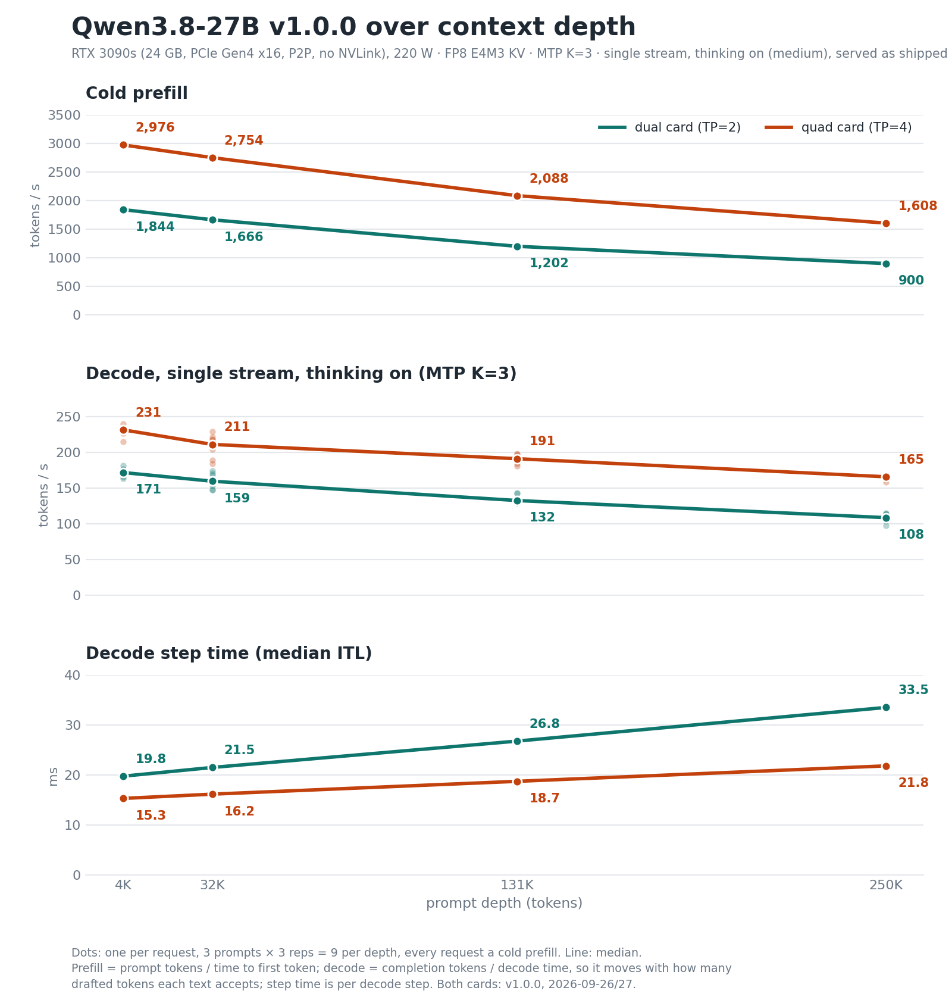

# Bench card, v1.0.0: dual card (TP=2) and quad card (TP=4)

v1.0.0 = stock vLLM 0.30.0 + patches 0001–0005 + `--long-prefill-token-threshold 832`, served by the shipped
`serve/serve.sh` (dual card, TP=2) and `serve/serve-tp4.sh` (quad card, TP=4) with no knob set.

**Reference host.** RTX 3090s (24 GB, sm_86), PCIe Gen4 x16 to every card, P2P-enabled driver, 220 W cap. The dual
card profile uses one pair of the four cards. **Served as shipped:**
- thinking on (medium);
- server-side sampling: T 1.0, top-p 0.95, top-k 20;
- FP8 E4M3 KV with calibrated scales;
- MTP K=3 unless a cell says `SPEC_K=1`;
- cold nonce prompts.

**Units.** Context depths are prompt targets: 4K = 4,096; 32K = 32,768; 131K = 131,072; 250K = 250,000 tokens. The actual prompt lengths (3,937 / 32,602 / 130,903 / 249,826) are in the rows. "cN" = N concurrent streams.

**Evidence.** Every figure is a maintainer measurement on the reference host, served as shipped (quad card sections 1–4 at
the earlier pin, see the pin note below; the flag spelling `--kv-cache-memory-bytes` in the tagged scripts postdates the
measurements, which used vLLM's accepted short form). The raw rows,
harnesses and gate records are not published (the section 6 comparisons against earlier builds come from those rows).

## At a glance

| | dual card (TP=2) | quad card (TP=4) | quad / dual |
|---|---:|---:|---:|
| FP8 KV pool, K=3 (K=1), shipped pins | **794,351** (810,191) | **1,949,844** (1,987,859) | 2.45× |
| full 262K sessions at once (131K) | 3 (6) | 7 (14) | |
| single-stream decode step, 4K → 250K | 19.76 → 33.51 ms | 15.32 → 21.83 ms | 1.29–1.54× faster |
| tokens per decode step (MTP K=3) | 3.41–3.54 | 3.40–3.53 | |
| single-stream decode, 4K → 250K | 171.4 → 108.3 tok/s | 231.2 → 165.5 tok/s | 1.32–1.53× (over the four depths) |
| cold prefill, 4K / 250K prompt (prompt tokens ÷ TTFT) | ≈1,840 / 900 tok/s | ≈2,980 / 1,610 tok/s | 1.61–1.79× |
| decode throughput, K=3, c1 / c8 / c32 | 119.6 / 520.6 / 771.7 tok/s | 148.9 / 701.9 / **1,120.9** tok/s | 1.24–1.45× |
| decode throughput, K=1, c1 / c8 / c32 | 106.6 / 644.3 / 946.4 tok/s | 150.4 / **849.6** / 948.1 tok/s | |
| end to end with prefill, c8 / c32 | 165.5 / 178.9 tok/s | 254.1 / 281.8 tok/s | 1.54–1.58× |
| chat TTFT during a cold 250K prefill, LPT on / off | **3.41 s** / 276.0 s | **2.02 s** / 149.4 s | |

The quad / dual column divides the quad card figure by the dual card one, except for step time, where it is dual ÷ quad (so > 1 means faster on quad card).

**Quad card pin.** The quad card measurements in sections 1–4 were taken at an earlier pin, 18,381,091,779 B per GPU (2,010,034 tokens, 2,048,841 at K=1, about 0.17 GiB free per card). v1.0.0 ships 17,832,100,834 B (1,949,844 tokens), which leaves about 1 GB free per card for other machines' overhead. It was re-verified at that pin on 2026-09-27: patch proofs on 4/4 ranks, warm prefix, tool call, reasoning, vision, JSON-schema output at 8 concurrent and a cold 261,632-token needle all pass. Measured free memory was 997 MiB per card idle and about 950 MiB at the smokes' peak.

## 1. Single stream over context depth

- c1, 3 prompts × 3 reps per depth (9 requests); every request had 0 cached tokens.
- Median ITL = the median over the 9 requests of each request's median inter-chunk latency.
- ITL is per decode step; one step emits tokens/step tokens on average.
- Prefill ≈ prompt tokens ÷ median TTFT. That includes scheduling, so it slightly understates prefill at 4K.
- Decode = completion tokens ÷ decode time for the one stream (median of the 9 requests); it moves with how many drafted
  tokens each text accepts, so it is noisier than step time. It is a different aggregate from tokens/step ÷ median ITL
  (per-request rates, medianed) and sits up to ~6 % above it at depth (quad card 250K: 165.5 vs 156).

| depth | dual ITL | quad ITL | step-time ratio | dual tok/step | quad tok/step | dual decode | quad decode | dual TTFT | quad TTFT | dual prefill | quad prefill |
|---|---:|---:|---:|---:|---:|---:|---:|---:|---:|---:|---:|
| 4K | 19.76 ms | **15.32 ms** | 1.29× | 3.41 | 3.53 | 171.4 tok/s | 231.2 tok/s | 2.1 s | 1.3 s | 1,844 tok/s | 2,976 tok/s |
| 32K | 21.51 ms | **16.17 ms** | 1.33× | 3.42 | 3.40 | 159.3 tok/s | 210.8 tok/s | 19.6 s | 11.8 s | 1,666 tok/s | 2,754 tok/s |
| 131K | 26.78 ms | **18.73 ms** | 1.43× | 3.51 | 3.45 | 132.3 tok/s | 190.8 tok/s | 108.9 s | 62.7 s | 1,202 tok/s | 2,088 tok/s |
| 250K | 33.51 ms | **21.83 ms** | 1.54× | 3.54 | 3.41 | 108.3 tok/s | 165.5 tok/s | 277.6 s | 155.4 s | 900 tok/s | 1,608 tok/s |

- The quad card's step-time advantage grows with depth, from 1.29× at 4K to 1.54× at 250K.
- **Measured:** dual card 2026-09-26 20:51–21:56 UTC; quad card 2026-09-27 00:55–02:02 UTC.

## 2. Decode throughput (1 to 32 streams)

**Shape:** decode-heavy, ≈54-token prompts and 1,024-token outputs, with every stream length-capped.

**Metric:** `window_tok_s` = tokens/s over the window from the last stream's first token to the first stream's finish, so every stream is decoding. Median of 3 reps; the reps are in the table after this one.

| streams | dual K=3 | dual K=1 | quad K=3 | quad K=1 |
|---|---:|---:|---:|---:|
| 1 | **119.6** | 106.6 | 148.9 | **150.4** |
| 2 | **227.1** | 208.4 | 277.1 | **287.3** |
| 4 | **393.2** | 390.1 | 481.2 | **513.0** |
| 8 | 520.6 | **644.3** | 701.9 | **849.6** |
| 32 | 771.7 | **946.4** | **1,120.9** | 948.1 |

Bold = the faster `SPEC_K` for that card and load.
- **Dual card:** K=3 wins at 1–2 streams; they are level at 4; K=1 wins from 8.
- **Quad card:** level at 1 stream; K=1 wins from 2 to 8; K=3 wins at 32.
- K=3 (the default) is the better single-stream choice on dual card (level on quad card) and the better 32-stream choice
  on quad card; on dual card K=1 leads from 8 streams.

| streams | dual K=3 reps | dual K=1 reps | quad K=3 reps | quad K=1 reps |
|---|---|---|---|---|
| 1 | 120.0, 119.6, 115.7 | 108.4, 105.6, 106.6 | 152.9, 148.9, 148.1 | 150.2, 151.6, 150.4 |
| 2 | 225.5, 230.4, 227.1 | 208.4, 208.1, 209.9 | 278.2, 277.1, 276.4 | 287.3, 287.5, 287.0 |
| 4 | 393.2, 395.3, 389.4 | 388.9, 390.1, 390.6 | 481.2, 482.8, 479.9 | 503.2, 513.0, 513.7 |
| 8 | 515.6, 520.6, 523.1 | 644.3, 642.9, 644.7 | 689.3, 702.3, 701.9 | 855.7, 849.6, 849.4 |
| 32 | 711.0, 771.7, 773.5 | 946.4, 933.9, 972.2 | 964.6, 1,120.9, 1,124.2 | 925.6, 948.1, 960.5 |

- **Dual card:**
  - K=3 and K=1 ran on the host's two card pairs, which differ by about 5 %.
  - The c8/c32 cells were measured on 2026-09-26; the c1/c2/c4 cells on 2026-09-27 00:50–00:54 UTC, in fresh boots of the same scripts on the same card pairs.
- **Quad card:**
  - K=3 and K=1 ran in separate boots on the same four cards, 2026-09-27.
  - The first K=3 c32 rep is low (964.6 tok/s); the other two agree within 0.3 %.

## 3. End to end, prefill included

**Shape:** 2,048-token prompts, 512-token budget, 3 reps. **Aggregate** = completion tokens ÷ wall time of the whole batch, prefill included.

| load | dual card | quad card | tokens/step (dual / quad) |
|---|---:|---:|---|
| c8 | 165.5 tok/s [165.5, 166.1, 163.6] | 254.1 tok/s [266.0, 232.1, 254.1] | 3.46 / 3.49 |
| c32 | 178.9 tok/s [178.9, 173.3, 181.6] | 281.8 tok/s [284.7, 281.1, 281.8] | 3.49 / 3.46 |

## 4. Long cold prefills and other requests

**Probe:** 2 reps per arm, paired boots on the same cards: `LPT=0` (flag off) against the shipped `LPT=832`. Each rep starts:
- one streaming resident request;
- then a cold 250K request;
- then, while the long prefill runs, 4 chat requests: 2 short (~35 tokens) and 2 medium (~1,540 tokens).

| | dual, `LPT=0` | dual, `LPT=832` | quad, `LPT=0` | quad, `LPT=832` |
|---|---:|---:|---:|---:|
| medium chat TTFT, median of 4 | 276.0 s | **3.41 s** | 149.4 s | **2.02 s** |
| short chat TTFT | 5.0–7.3 s | 2.2 s | 3.5–5.9 s (one of four: 151.3 s) | 1.2–1.4 s |
| decode step of the chats while the prefill runs | 2.5–3.4 s | 0.54–0.66 s | 1.39–1.86 s | 0.34–0.39 s |
| resident stream, chunks/s during the prefill | 0.36–0.37 | 1.15 | 0.71–0.73 | 2.06–2.10 |
| resident stream, chunks/s before and after | ≈50 | ≈50 | ≈65 | ≈65 |
| long request's own TTFT, median of 2 | 282.4 s | 286.0 s (+1.3 %) | 155.3 s | 160.3 s (+3.2 %) |

**What the flag changes:**
- With the flag, the chats start within seconds.
- Until the long prefill finishes, the chat streams decode slowly: 0.5–0.7 s per step on dual card, 0.34–0.39 s on quad card
  (the resident stream: 1.15 and 2.06–2.10 chunks/s, table above). With MTP one step can emit several tokens. Speed returns to normal when the prefill completes.
- The flag costs the long request 1.3 % (dual) and 3.2 % (quad) of its own TTFT.
- On the dual card boots, decode-heavy aggregate is unchanged by the flag: c8 520.6 vs 518.5 tok/s (1.004×), c32 771.7 vs 772.8 (0.999×), on vs off.
- An earlier build showed the same effect with a cold 131K prefill on dual card: chat TTFT ~106 s without the flag, 1.9–3.6 s with it, +3.6 % on the long request.

## 5. KV pool and SPEC_K

| | dual card | quad card |
|---|---:|---:|
| KV pin per GPU (`KV_BYTES`), shipped | 14,534,914,979 B | 17,832,100,834 B |
| pool at K=3 (default) | 794,351 tokens | 1,949,844 tokens |
| pool at K=1 (`SPEC_K=1`) | 810,191 tokens | 1,987,859 tokens |
| host embedding table per GPU (patch 3) | 1.184 GiB | 0.592 GiB |

- At the same byte pin the pool holds about 2 % more tokens with K=1 than with K=3.
- **Quality and stability at K=1** are in the README: GSM8K-200 paired against K=3, and a 30-minute soak, both on dual card. At quad card, K=1 has throughput numbers only.
- **Single stream:** K=1 is 10.9 % slower than K=3 on dual card and level on quad card. On agent-shaped load on an earlier build (tool calls + reasoning, 30–130K contexts at 6 concurrent, 30–60K at 15), K=1 and K=3 were within run-to-run noise at 6
  and had no clear winner at 15.
- Patch 0005 is inert at K=1: there is no second draft step, so its proof line does not print.

## 6. Against earlier builds

**Dual card: v1.0.0 vs the unpublished three-patch build** ([`2026-09-25/BENCH-CARD.md`](../2026-09-25/BENCH-CARD.md), patches 1–3, no long-prefill threshold). It was measured the day before on the same card pair with 3 requests per depth, so this is a cross-day comparison.

| cell | v1.0.0 | three-patch | Δ | tokens/step (three-patch → v1.0.0) |
|---|---:|---:|---:|---|
| c1 4K | **19.76 ms** | 21.24 ms | −7.0 % | 3.58 → 3.41 |
| c1 32K | **21.51 ms** | 23.19 ms | −7.2 % | 3.46 → 3.42 |
| c1 131K | **26.78 ms** | 28.67 ms | −6.6 % | 3.62 → 3.51 |
| c1 250K | **33.51 ms** | 35.04 ms | −4.4 % | 3.49 → 3.54 |
| c8 @2048 | 165.5 tok/s | 166.1 | −0.4 % | 3.47 → 3.46 |
| c32 @2048 | 178.9 tok/s | 175.0 | +2.2 % | 3.46 → 3.49 |

- **The c1 gain is a cheaper step, not better draft acceptance.** Tokens/step moves both ways, while ITL is lower in every c1 cell.
- **Attribution to patches 0004 and 0005 is controlled at 4K and 32K only.** On the pre-release five-patch build, a same-session boot on the same card pair with both switched off (`VLLM_GDN_BA_SPLITK=0 VLLM_DRAFT_SEQ_LENS_NOSYNC=0`) ran c1 at 21.41 / 23.30 ms at 4K / 32K, within 1 % of the three-patch card. The 131K and 250K deltas rest on the cross-day comparison.
- **c8 / c32 are unchanged within rep noise.** v1.0.0's reps spread by 2.5 tok/s at c8 and 8.3 tok/s at c32.
- **v1.0.0 vs the pre-release five-patch build:** they differ only by a function rename in patch 0003. Against that build's dual card run (2 reps), every c1 cell is within +0.9 % / −0.4 %, and c8 / c32 are +0.6 % / −2.1 %.

**Quad card: pre-release five-patch build.** Superseded by the v1.0.0 quad card figures above, and kept for the record.
- Measured 2026-09-26 15:29–15:38 UTC, 2 reps per cell.
- `serve/serve-tp4.sh` as shipped at that time: same flags as v1.0.0's, at the earlier pin 18,381,091,779 B (2,010,034 tokens).
- Measured while the host had logged corrected PCIe errors on one card (one during the 4 × 262K test); no uncorrected
  errors, no failures.

| cell | v1.0.0 | pre-release five-patch | three-patch | Δ five-patch vs three-patch | TTFT (three-patch → five-patch) |
|---|---:|---:|---:|---:|---|
| c1 4K | **15.32 ms** | 15.40 ms | 16.63 ms | −7.4 % | 1.3 → 1.3 s |
| c1 32K | **16.17 ms** | 16.37 ms | 17.62 ms | −7.1 % | 11.4 → 11.9 s |
| c1 131K | **18.73 ms** | 18.89 ms | 20.18 ms | −6.4 % | 61.5 → 63.1 s |
| c1 250K | **21.83 ms** | 22.03 ms | 23.28 ms | −5.4 % | 153.1 → 156.4 s |
| c8 @2048 | 254.1 tok/s | 236.0 [234.4, 237.6] | 231.9 | +1.7 % | |
| c32 @2048 | 281.8 tok/s | 260.3 [229.6, 291.0] | 264.3 | −1.5 % | |

On the pre-release build, quad card TTFT was 2–5 % higher at 32K–250K than on the three-patch build (32K +4.4 %, 131K +2.6 %, 250K +2.2 %). The likely cause is the long-prefill threshold splitting the prefill; it was not isolated.

